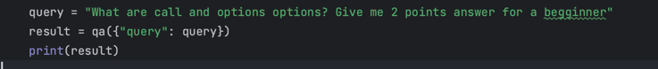

## Theory

## What is RAG (Retrieval Augmentation Generation)

*Pre-Trained Large Language Models (LLMs) + Own Data -> Generate Response*

- Embeddings
  *Own Data -> OpenAI Embeddings (LLM Embeddings) -> Vector Array*
- Vector Stores 
  - PineCone
    - Pinecone's vector database is fully-managed, developer-friendly, and easily scalable.
    - Create an account and your first index with a few clicks or API calls. 
    - Use the latest AI models and reference our extensive developer docs to start building AI powered applications in minutes.
      - 
      - 
      - 
      - 
  - FAISS
    - https://github.com/facebookresearch/faiss
    - In Memory vector store. Created by Meta's Fundamental AI Research group under MIT licence.
    - Usually vector stores operates on GPUs, but FAISS allow to run vector store on your local CPU.
    - It contains algorithms that search in sets of vectors of any size, up to ones that possibly do not fit in RAM. 
    - Some of the most useful algorithms are implemented on the GPU.
- LangChain Document Loaders
  - https://python.langchain.com/docs/modules/data_connection/document_loaders/
  - `Use document loaders to load data from a source as Document's. 
     A Document is a piece of text and associated metadata. 
     For example, there are document loaders for loading a simple .txt file, for loading the text contents of any web page, or even for loading a transcript of a YouTube video. 
     Document loaders expose a "load" method for loading data as documents from a configured source. 
     They optionally implement a "lazy load" as well for lazily loading data into memory.`
- LangChain Text Splitters
  - https://python.langchain.com/docs/modules/data_connection/document_transformers/#text-splitters
  - `Text splitters work as following:
     1. Split the text up into small, semantically meaningful chunks (often sentences).
     2. Start combining these small chunks into a larger chunk until you reach a certain size (as measured by some function).
     3. Once you reach that size, make that chunk its own piece of text and then start creating a new chunk of text with some overlap (to keep context between chunks).` 

## Hands-On
### Dependencies
- pipenv install langchain
- pipenv install black
- pipenv install openai
- pipenv install pinecone-client
- pipenv install tiktoken
- pipenv install pycco
- pipenv install sphinx_bootstrap_theme

## RetrievalQA Chain Implementation
- 
- 

## Reference
